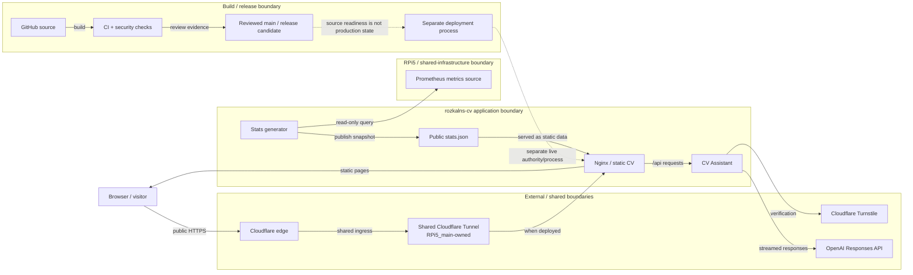

# Architecture and trust boundaries

This is a **source architecture and ownership view**, not a production-status report. It documents the reviewed request, build, observability and provider boundaries represented by this repository. It does not assert that these components are currently deployed or healthy; live state requires separate runtime evidence.

## Recruiter-readable view

## Boundary annotations

- **Build** — GitHub source is validated by deterministic CI/security checks before reviewed `main` becomes a release candidate. CI evidence does not itself deploy production.
- **Serve** — Nginx serves the static multilingual CV and proxies the application API to the CV Assistant. The application source lives in this repository.
- **Observe** — the stats generator performs read-only Prometheus queries, writes the public `stats.json` snapshot, and the frontend renders that snapshot. The diagram represents the data path, not current metric freshness.
- **External provider** — Turnstile verification and OpenAI Responses are explicit outbound service boundaries. Their account configuration, availability and runtime health are not inferred from repository source.
- **Shared ingress** — the Cloudflare Tunnel connector is host-wide infrastructure owned by `RPi5_main`. This repository does not own the shared Tunnel connector, its credentials, lifecycle, readiness, reconciliation or rollback.

## Ownership contract

`rozkalns-cv` owns the reviewed application-side source and contracts for the static CV surface, Nginx configuration, CV Assistant, stats generation, deterministic builds and source validation.

`RPi5_main` owns the shared host-ingress connector lifecycle. A source change in this repository must not redefine that shared connector as application-owned infrastructure.

Source readiness and production state are deliberately separate. A green commit or merged change proves only the reviewed source/check state represented by GitHub evidence; production deployment and live health require separate evidence and authority.

## Public evidence anchors

| Boundary | Public source evidence |
| --- | --- |
| Nginx/static surface and CV Assistant proxy | `nginx.conf`, `docker-compose.yml` |
| CV Assistant -> OpenAI Responses | `bot/provider.py`, `bot/config.py` |
| Turnstile verification boundary | `frontend/core/turnstile.mjs`, `bot/turnstile.py` |
| Prometheus-derived public stats | `scripts/generate-stats.py`, `frontend/features/stats.mjs`, `docs/LIVE_STATS.md` |
| Shared Cloudflare Tunnel ownership | `README.md`, `tests/test_compose_ingress_boundary.py` |
| Deterministic CI/release boundary | `.github/workflows/ci.yml`, `README.md` |

These anchors describe reviewable source contracts. They are intentionally stable branch/path references rather than claims about a particular live deployment.
